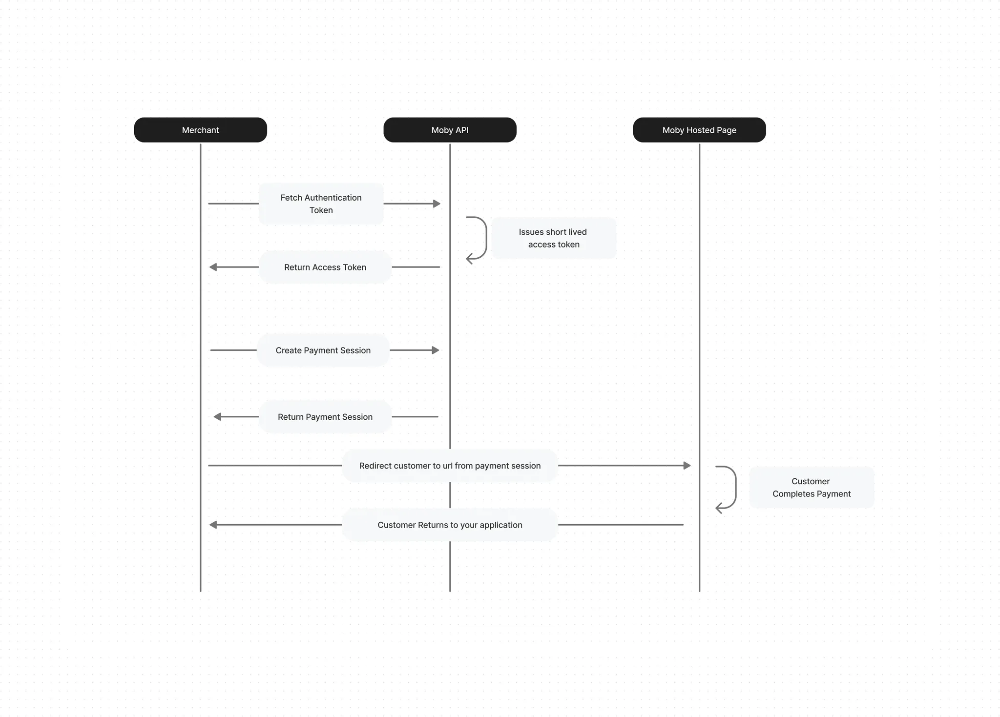

# Table of Contents

- [Hosted Payment](#hosted-payment)
- [Verifying the Signature of Calls](#verifying-the-signature-of-calls)
- [Handling Notifications](#handling-notifications)

# Hosted Payment

A Hosted Payment Page is a secure method through which customers can make online payments. It's a webpage where transaction details are entered and processed. This page is hosted by Moby, thus reducing the risk of security breaches and providing a seamless payment experience for customers. This guide will walk you through how to integrate our Hosted Payment Page into your application.

## Quick Start Guide

Welcome to the Quick Start Guide for Moby Hosted Payment! In just a few simple steps, you'll be ready to integrate our payment solutions into your application and offer your customers a seamless payment experience. Let's get started.



## Moby Hosted Page Workflow

### Step 1: Retrieve Your Authorization Token

To ensure secure transactions, the first step in integrating with Moby Payments is to obtain an authorization token. This token is necessary for authenticating your API requests and is valid for a short period of time to enhance security.

### **How to Retrieve Your Token:**

1. **Make an API Call**: Use the following endpoint to request your authorization token:
   **POST /api/auth/token**
   
2. **Provide Your Credentials**: In the request, include your Moby Payments client ID and secret. These were provided to you when you registered for an account.
3. **Receive Your Token**: The response will include an **token** that you will use in subsequent API calls. Note that the token expires after a set period, typically 60 minutes.

Example Request:

```bash
  curl -X POST "[PAYMENT_URL]/api/auth/token" \
     -H "Content-Type: application/json" \
     -d '{"clientID": "your_client_id", "secretKey": "your_client_secret"}'
```

### Step 2: Redirect User to the Payment Page

With the authorization token, you can now create a payment session for your user. This involves specifying the payment details and receiving a payment link in response.

### How to Create a Payment Session:

1. **Initiate Payment Session**: Call the payment initiation endpoint with the necessary payment details and your authorization token.
   **POST /api/merchant/payment/checkout/hosted**
2. **Include Payment Details**: Provide the amount, customer information, and any additional details required for the transaction.
3. **Receive Payment Link**: The API response will include a URL to the Moby Payments page where your customer can complete the payment.

Example Request:

```bash
curl -X POST "[PAYMENT_URL]/api/merchant/payment/checkout/hosted" \
     -H "Authorization: Bearer your_access_token" \
     -H "Content-Type: application/json" \
     -d '{
         "clientId": "YOUR_CLIENT_ID"
         "customerName": "customer name",
         "customerEmail": "customer@example.com",
         "customerMobile": "0111222333",
         "referenceNo": 100,
         "details": "additional information"
         "amount": 100,
         "returnUrl": "https://yourapp.com/payment/complete",
         "callbackUrl": "https://yourapp.com/payment/moby/status",
         "cart": "Purchased items details" (Array - Optional),
        }'
```

### **Step 3: Complete the Payment**

After the customer completes the payment process on the Moby Payments page, they will be automatically redirected back to your application via the **return_url** you provided. This URL can handle any post-payment processing or status updates necessary for your application.

### **Payment Completion Flow:**

1.  **Customer Redirect**: Following a successful payment, the customer is redirected to your specified return URL.
2.  **Verify Payment**: Optionally, you can verify the payment status by calling the payment verification endpoint with the transaction ID received upon redirection.
3.  **Confirm Payment**: Update your system with the payment status, completing the integration process.

Example Response:

```bash
{
  "referenceNo": "Payment Reference",
  "transactionId": "Your Payment ID",
  "amount": "Payment Amount",
  "payMethod": "Payment Method Used By The User",
  "status": "Payment Status",
  "time": "Payment Time",
  "merchantOrderRef" : "Order refrence",
  "description": "Payment Description",
  "signature": "Request Signature"
}
```

Congratulations! You have now integrated Moby Payments into your application. With these three simple steps, you're ready to offer a seamless and secure payment experience to your customers. But there's more to robust integration than just getting started. To ensure your application is secure and resilient, it's essential to delve into two additional aspects:

[Verifying the Signature of Calls](#verifying-the-signature-of-calls)

[Handling Notifications](#handling-notifications)

## Getting Your Credentials

### Payment URL

Base on the environment that you are working on, you can use one of the following urls:

```bash
Sandbox Environment:
dev.pay.mobycheckout.com

Production Environment
pay.mobycheckout.com
```

### Client ID & Secret Key

Upon completion of the onboarding process, you will be provided with a Client ID and Secret Key. Please note that the Client ID is equivalent to your Merchant ID and the Secret Key is equivalent to your API Key.

## API Reference

For a more detailed understanding and complete reference to our API, please visit the link below.

[MobyPay API Reference](https://documenter.getpostman.com/view/32981011/2sA2xnzAvK)

# Verifying the Signature of Calls

Security is paramount in payment processing. Verifying the signature of callbacks from Moby Payments ensures that the information received is indeed from Moby Payments and has not been tampered with.

### How to Verify Signatures:

1.  **Receive the Callback**: When Moby Payments sends a callback to your server (e.g., payment status updates), it includes a signature header. This signature allows you to verify the authenticity of the request.
2.  **Extract the Signature**: The signature is sent in a body of the response named signature. Extract this from the incoming request.
3.  **Generate Your Signature**: Using the payload of the callback and your secretKet, generate a hash using the same algorithm that Moby Payments uses (e.g., HMAC-SHA256).
4.  **Compare Signatures**: Compare the signature you generated with the one sent by Moby Payments. If they match, the request is authentic.

Sample Code

```bash
const crypto = require('crypto');

/**
 * Generates an HMAC SHA256 signature from given parameters and a secret key.
 * @param {Object} params - The parameters to be signed, as key-value pairs.
 * @param {string} secretKey - The secret key used for signing.
 * @return {string} The generated signature.
 */
function generateSignature(params, secretKey) {
    // Sort the parameters by key
    const sortedKeys = Object.keys(params).sort();
    let sortedString = '';

    // Concatenate the sorted parameters into a single string
    sortedKeys.forEach(key => {
        sortedString += params[key];
    });

    // Generate the HMAC SHA256 hash of the concatenated string using the secret key
    const signature = crypto.createHmac('sha256', secretKey)
                            .update(sortedString)
                            .digest('hex');

    return signature;
}

// Example usage
const params = {
    order_id: '12345',
    amount: '100',
    currency: 'USD',
};
const secretKey = 'your_secret_key';

const signature = generateSignature(params, secretKey);
console.log('Generated Signature:', signature);

```

# Handling Notifications

Efficiently manage notifications from Moby Payments to handle transactions, especially unsuccessful ones. When integrating with Moby Payments, you have the option to provide a **callback_url**. This URL is used by Moby Payments to send direct callbacks to your system, acting similarly to a webhook. Whenever a transaction occurs, Moby Payments will make a request to this **callback_url** with a payload containing the transaction details. This enables your system to receive real-time notifications about transactions, allowing you to process and respond to each event accordingly.

Here’s what you need to do to handle those calls:

1.  Verify: before action on any calls to this endpoint, you first need to verify the signature, [see here](#verifying-the-signature-of-calls)
    ).
2.  Process & Response: Update your system based on the details given and respond to the call with the following message:

Status to be returned by your end.

```bash
{
  "status": 'success',
}
```

Example Request Body

```bash
{
  "referenceNo":"234test1232111111qw343",
  "transactionId":"******11196916084427898",
  "amount":"60.00",
  "payMethod":"TEST",
  "status":"success",
  "time":"2025-11-19 14:52:52",
  "merchantOrderRef":null,
  "description":"Approved",
  "signature":"ac5e3e158839b691f69a7a933035f75b443ef3c4e40f7e8bf82ae1af68fa3ebb"
}
```

## Additional Support

For further assistance, you can reach our support teams:

- **Customer Care**:

  - Email: [customercare@moby.my](mailto:customercare@moby.my)
  - Phone: 011 1111 5155

- **Merchant Support**:
  - Email: [merchantsupport@moby.my](mailto:merchantsupport@moby.my)
  - Phone: 011 1111 7177

[Return to Home](../README.md)
