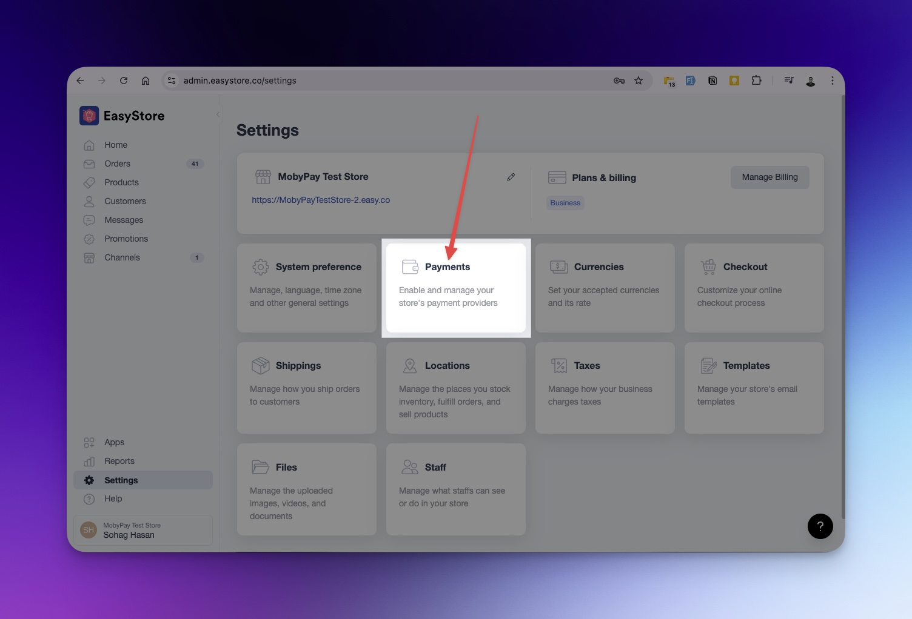

## Integrating Moby Checkout with Your EasyStore Shop

Welcome to the Moby Checkout integration guide for EasyStore! This guide provides a step-by-step walkthrough to help you seamlessly add Moby Checkout as a payment option on your EasyStore platform. By integrating Moby Checkout, you’ll offer your customers a secure and convenient payment experience, optimizing their shopping journey and enhancing your store’s payment process.

**1. Nevigate to settings from your Shop Admin panel**
   

**2. Select the Payments Option**
   

**3. Click the "Add Payment Method" Button**
   

**4. Search for "Moby Checkout"**
   

**5. Enter Your Client ID and Secret Key**
   Use the Client ID and Secret Key provided by Moby Checkout.
   

By completing these steps, you’ll successfully add Moby Checkout to your EasyStore shop, enabling a smooth and efficient payment experience for your customers.

## Additional Support

For further assistance, you can reach our support teams:

- **Customer Care**:  
  - Email: [customercare@moby.my](mailto:customercare@moby.my)  
  - Phone: 011 1111 5155

- **Merchant Support**:  
  - Email: [merchantsupport@moby.my](mailto:merchantsupport@moby.my)  
  - Phone: 011 1111 7177

[Return to Home](../README.md)