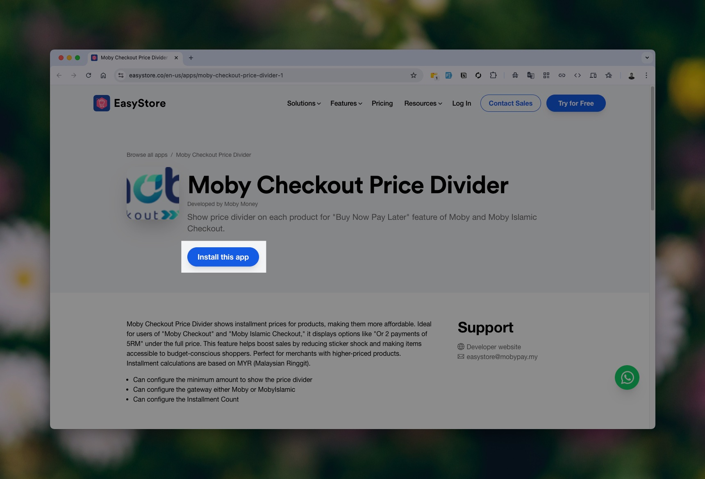
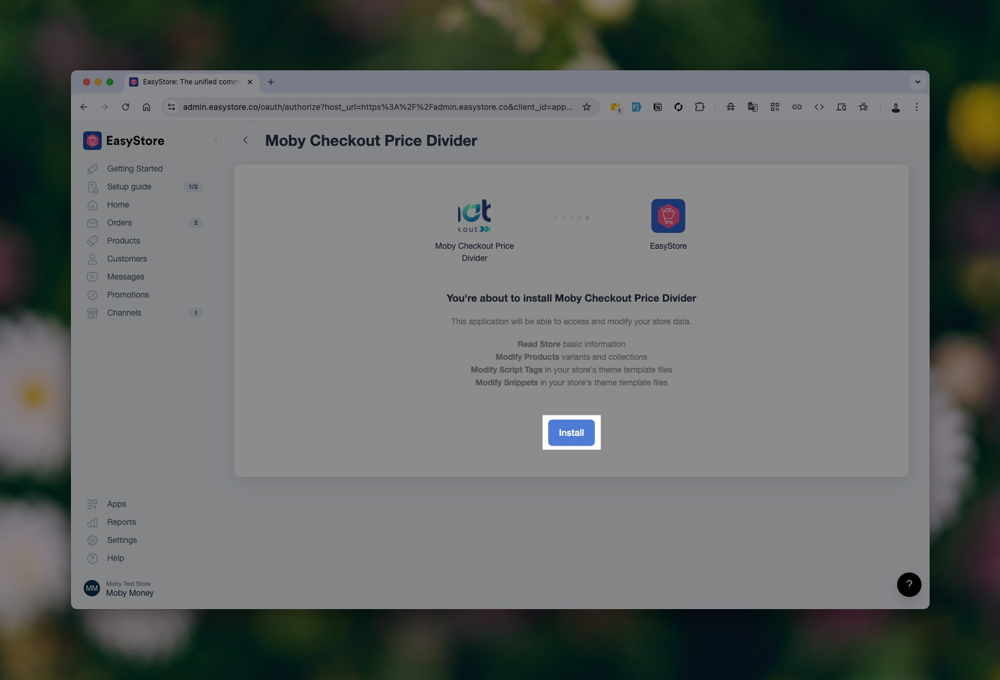
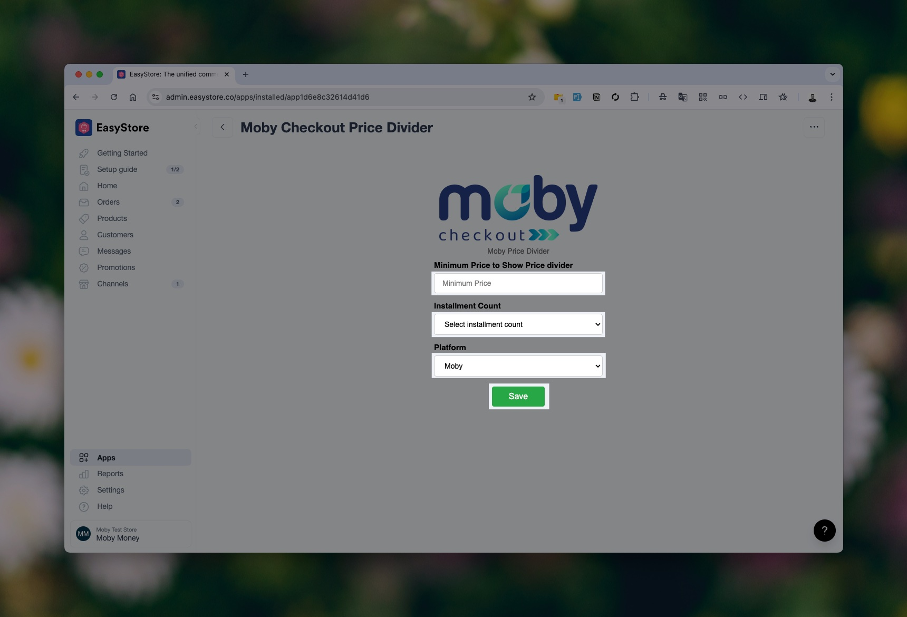
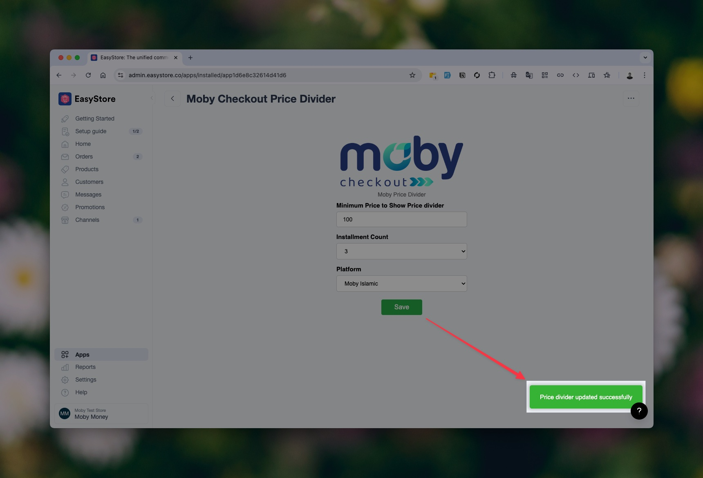
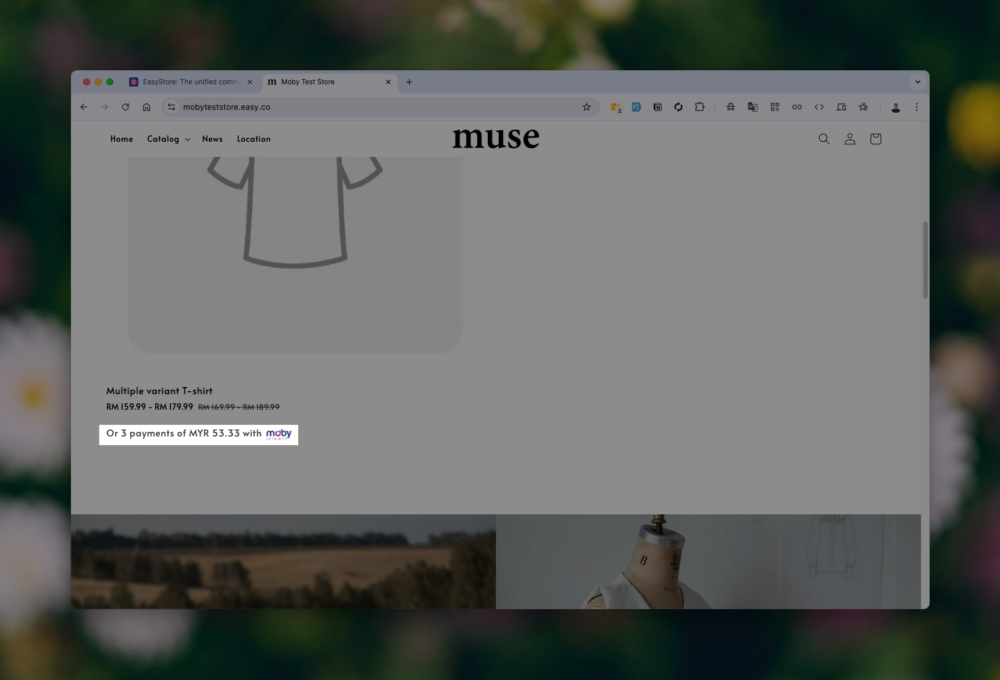
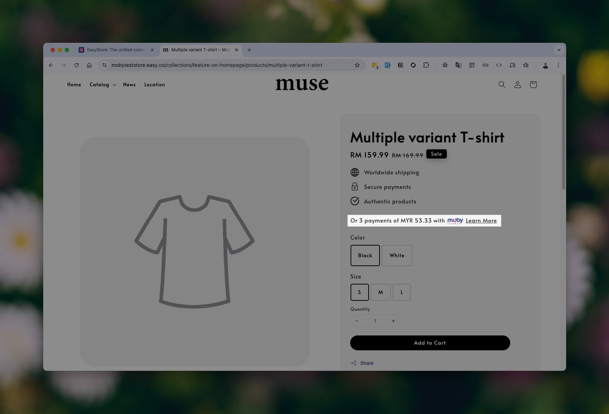
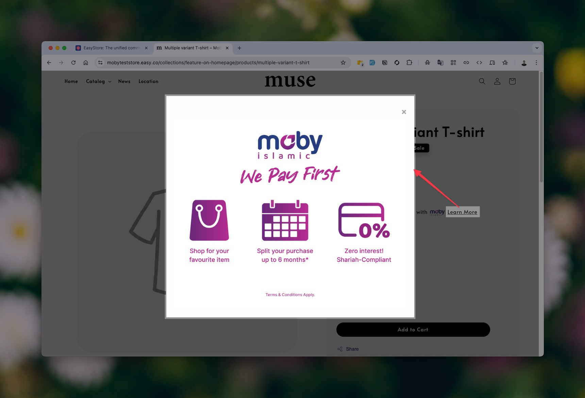

# EasyStore Integration Guide: Moby Checkout Price Divider

Welcome to the **Moby Checkout Price Divider** integration guide for EasyStore!  
This app helps you **display installment options** (e.g., 3-month or 6-month plans) directly **below product prices**—making it easier for your customers to make informed decisions and increasing your store’s conversion rates.

🔗 [Install the App on EasyStore](https://www.easystore.co/en-us/apps/moby-checkout-price-divider-1)

---

## Step 1: Open the Installation Link  
Navigate to the EasyStore App Store using the link above. This will take you to the **Moby Checkout Price Divider** app page.  

---

## Step 2: Click on the Install Button  
Click **"Install This App"** to begin the setup process. You may need to grant permission for the app to be added to your store.  

---

## Step 3: Complete the Configuration Form  
Once installed, you’ll be prompted to **fill in three required fields** (e.g., settings for the display type).  
After filling out the form, **click Save**.  

---

## Step 4: Confirmation Message  
A confirmation or success message will appear, letting you know the app has been successfully configured.  

---

## Step 5: Check Your Product Listings  
Visit your online store’s **product listing page**—you will now see the **Price Divider content** displayed right under the product prices.  

---

## Step 6: View on the Product Details Page  
Open a product’s individual details page to confirm that the **installment pricing** is also shown here.  
This helps ensure transparency at every step of the buyer’s journey.  

---

## Step 7: Modal with Platform Details  
When a user interacts with the installment content, a **modal popup** will display a breakdown of the selected platform’s installment plan.  

---

## 📞 Need Help?

If you run into any issues or have questions, feel free to reach out to our support teams:

- **Customer Care**  
  ✉️ [customercare@moby.my](mailto:customercare@moby.my)  
  📞 011 1111 5155  

- **Merchant Support**  
  ✉️ [merchantsupport@moby.my](mailto:merchantsupport@moby.my)  
  📞 011 1111 7177  

[Return to Home](../../README.md)
