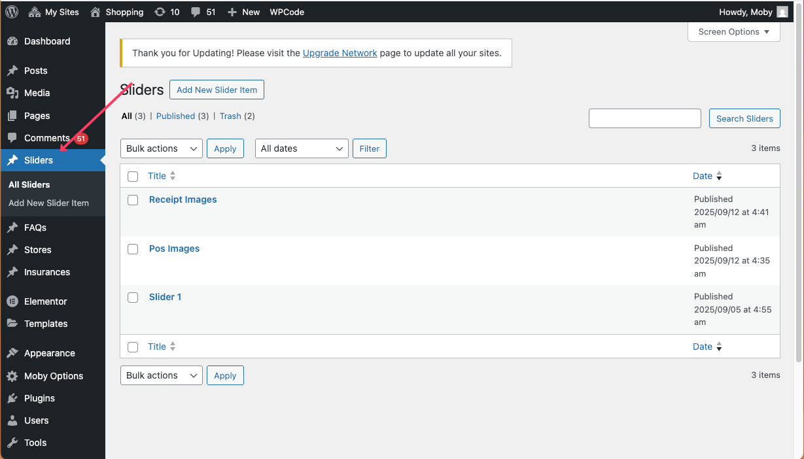
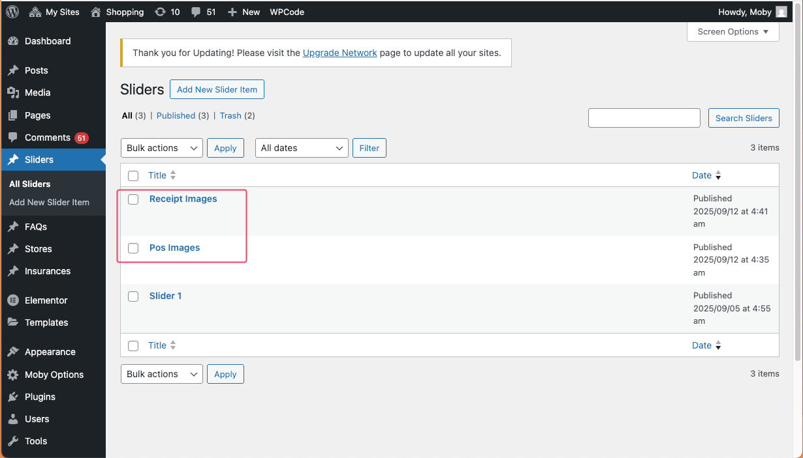
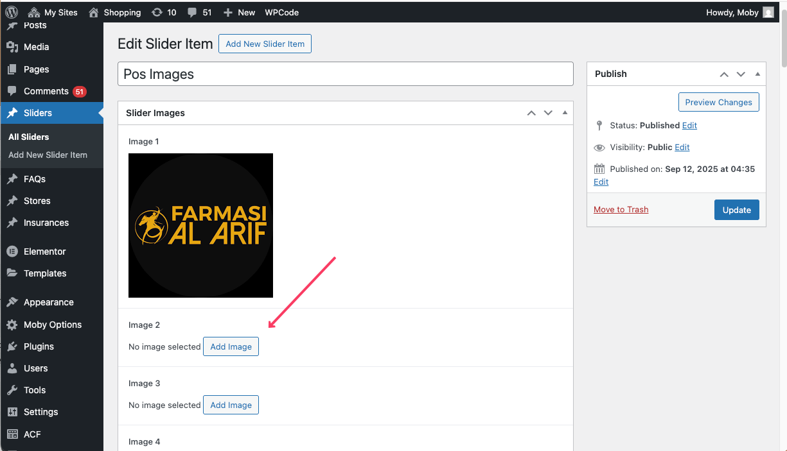
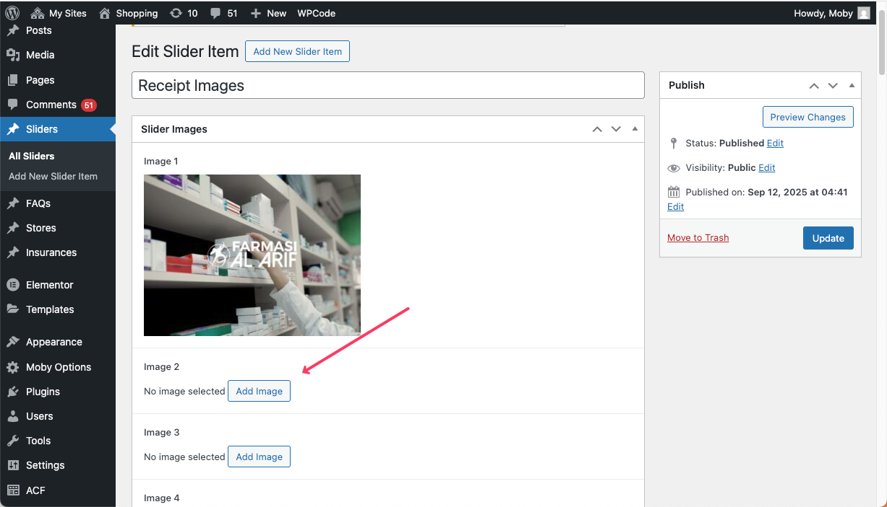
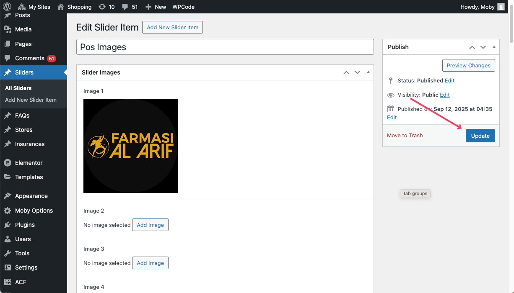

# Promotion Images Management

This documentation explains how promotion images are managed for the **POS terminal** and **Payment Receipt** using our WordPress integration.  

---

## Part 1: Admin Instructions

Promotion images are managed inside the **WordPress Admin Panel** under the custom post type **Sliders**.  

There are two slider items available:  

1. **POS Images** → Images for the POS terminal.  
2. **Receipt Images** → Images for the payment receipt.  

Any changes here will automatically reflect in the APIs.

---

### Step 1: Log in to WordPress Admin Panel

Navigate to your WordPress Admin dashboard.

---

### Step 2: Open the "Sliders" Tab

From the sidebar menu, click **Sliders**.  

You will see two available items:  
- **POS Images**  
- **Receipt Images**

---

### Step 3: Editing POS Images

Click on **POS Images**.  
Here, you can insert, update, or delete images for the POS terminal promotions.  

- Add as many images as you want.  
- It is not mandatory to fill all image fields — you can leave unused ones empty.  

Once updated, the changes will be reflected in the **POS Images API**.

---

### Step 4: Editing Receipt Images

Click on **Receipt Images**.  
Here, you can insert, update, or delete images for the payment receipt promotions.  

- Add as many images as you want.  
- It is not mandatory to fill all image fields — you can leave unused ones empty.  

### Step 5: Publish/Update the item

Once updated, the changes will be reflected in the **Receipt Images API**.

---

👉 Follow the same instructions whenever you need to manage promotion images for **Receipts**. 

---

## Summary

- **POS Images** → Manage images for the POS terminal.  
- **Receipt Images** → Manage images for the payment receipt.  
- APIs automatically fetch updated images from WordPress.  
- Admins can easily add, update, or remove images in the **Sliders** post type without filling all fields.