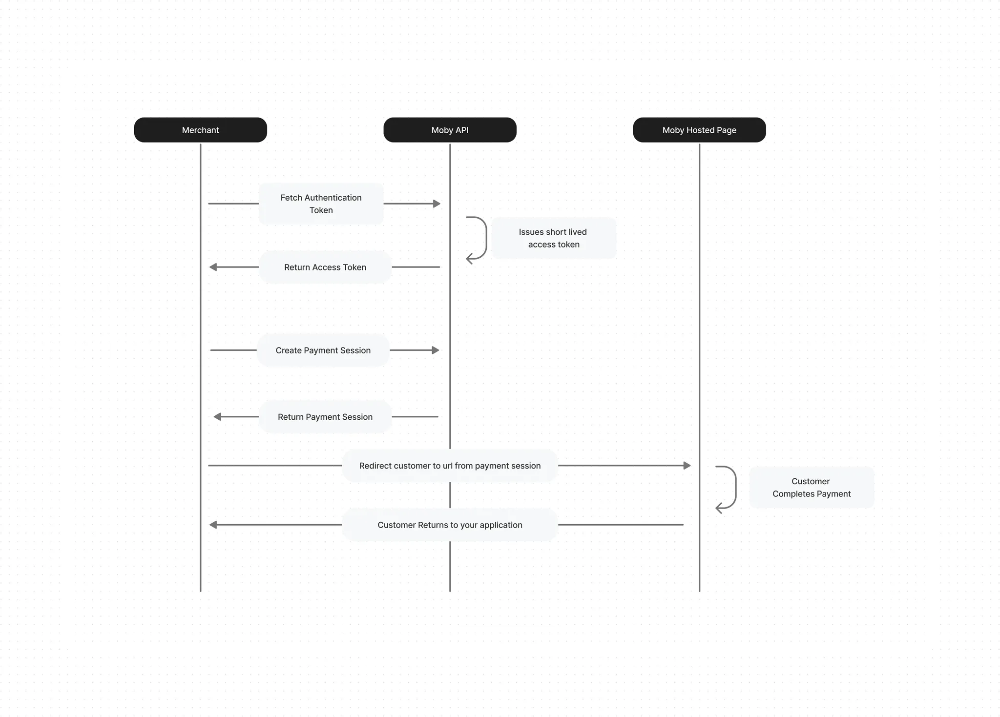

# Table of Contents
- [Recurring Payment](#recurring-payment)
- [Verifying the Signature of Calls](#verifying-the-signature-of-calls)
- [Handling Notifications](#handling-notifications)

# Recurring Payment

**Recurring payments** in the context of **MobyPay** refer to automatic, pre-authorized payments that are charged to a customer’s stored card on a regular schedule — such as monthly or annually — for ongoing services or products. 

This enables MobyPay merchants to offer seamless subscription-based experiences, while ensuring customers are billed securely and consistently without needing to manually initiate each transaction.

## Quick Start Guide

Welcome to the Quick Start Guide for **MobyPay Recurring Payments**!  
This guide will walk you through the essential steps to integrate our recurring payment solution into your application.

In just a few minutes, you’ll be ready to offer your customers a secure, seamless, and automated billing experience.

Let’s get started!

## Moby Recurring Page Workflow


### Step 1: Retrieve Your Authorization Token

To begin integrating with MobyPay, first obtain an **authorization token**.  
This token authenticates your API requests and is valid for a limited time to ensure security.

You'll need to include this token in the `Authorization` header as a Bearer token when making requests to our APIs.

### **How to Retrieve Your Token**

1. **Make an API Call**  
   Send a `POST` request to the following endpoint to obtain your authorization token:  
   **`POST /api/auth/token`**

   

2. **Provide Your Credentials**  
   In the request body, include your MobyPay `clientID` and `secretKey`. These credentials are issued when you register your account.

3. **Receive Your Token**  
   A successful response will include an **access token** that you’ll use to authenticate subsequent API requests.  
   _Note: The token typically expires after 60 minutes._

#### Example Request

```bash
curl -X POST "[PAYMENT_URL]/api/auth/token" \
     -H "Content-Type: application/json" \
     -d '{"clientID": "your_client_id", "secretKey": "your_client_secret"}'
```
### Step 2: Tokenize Customer Card

After retrieving your authorization token, the next step is to tokenize your customer's card.  
This allows you to securely store card details and receive a token that can be used for future payments.

---

#### 🔒 Endpoint

**`POST /api/v2/tokens`**

---

#### 🛡️ Authentication

Include your **Bearer token** in the request header to authorize the API call:
---

#### 📥 Required Fields

Send the following parameters in your request body:

| Field             | Type   | Description                         |
|-------------------|--------|-------------------------------------|
| `client_id`        | string | Your MobyPay client ID              |
| `customer_email`   | string | Customer's email address (valid)    |
| `customer_name`    | string | Full name of the customer           |
| `customer_mobile`  | string | Customer's mobile phone number      |

> All fields are **required** and must not exceed 255 characters.

---

#### 📤 Example Request

```bash
curl -X POST "[PAYMENT_URL]/api/v2/tokens" \
     -H "Content-Type: application/json" \
     -H "Authorization: Bearer YOUR_ACCESS_TOKEN" \
     -d '{
           "client_id": "your_client_id",
           "customer_email": "customer@example.com",
           "customer_name": "John Doe",
           "customer_mobile": "60123456789"
         }'
```

### Response
```json
{
  "success": true,
  "url": "https://..."
}
```

### Step 3: Charge the Stored Token

Once the customer’s card has been tokenized, you can initiate a payment by charging the stored token.  
MobyPay supports both **3DS-enabled** and **non-3DS** flows depending on your integration and customer preference.

---

#### 🔒 Endpoint

**`POST /api/v2/tokens/{token}/charges`**

Replace `{token}` with the actual token received during card tokenization.

---

#### 🛡️ Authentication

Include your **Bearer token** in the request header:

---

#### 📥 Required & Optional Fields

| Field               | Type     | Required | Description                                           |
|---------------------|----------|----------|-------------------------------------------------------|
| `amount`            | float    | ✅ Yes   | The amount to be charged (must be >= 0)              |
| `order_reference`   | string   | ✅ Yes   | Unique reference number for the transaction                |
| `merchant_reference`| string   | Optional | Optional identifier for internal reference           |
| `return_url`        | string   | Optional | URL for notification redirect   |
| `callback_url`      | string   | Optional | URL for notification callback                        |
| `skip_receipt`      | boolean  | Optional | If true, receipt will not be sent to the customer    |
| `details`           | string   | Optional | Extra info for the charge                            |
| `custom_data`       | JSON     | Optional | Any additional structured data                       |
| `3ds`               | boolean  | ✅ Yes   | Whether to use 3D Secure authentication              |

---

#### 📤 Example Request

```bash
curl -X POST "[PAYMENT_URL]/api/v2/tokens/{token}/charges" \
     -H "Content-Type: application/json" \
     -H "Authorization: Bearer YOUR_ACCESS_TOKEN" \
     -d '{
           "amount": 100.00,
           "order_reference": "ORD-123456",
           "merchant_reference": "INV-7890",
           "return_url": "https://yourapp.com/return",
           "callback_url": "https://yourapp.com/callback",
           "skip_receipt": false,
           "details": "Monthly Subscription",
           "custom_data": "{\"user_id\": \"abc123\"}",
           "3ds": true
         }'
```
If 3DS is enabled ("3ds": true), you will receive a redirect URL:
```json
{
  "success": true,
  "redirect_url": "https://..."
}
```

Congratulations! You have now integrated Moby Payments into your application. With these three simple steps, you're ready to offer a seamless and secure payment experience to your customers. But there's more to robust integration than just getting started. To ensure your application is secure and resilient, it's essential to delve into two additional aspects:

[Verifying the Signature of Calls](#verifying-the-signature-of-calls)

[Handling Notifications](#handling-notifications)


Getting Your Credentials
------------------------

### Payment URL

Base on the environment that you are working on, you can use one of the following urls:

```bash
Sandbox Environment:
dev.pay.mobycheckout.com

Production Environment
pay.mobycheckout.com
```

### Client ID & Secret Key

Upon completion of the onboarding process, you will be provided with a Client ID and Secret Key. Please note that the Client ID is equivalent to your Merchant ID and the Secret Key is equivalent to your API Key.

API Reference
-------------

For a more detailed understanding and complete reference to our API, please visit the link below.

[MobyPay API Reference](https://documenter.getpostman.com/view/32981011/2sA2xnzAvK)


# Verifying the Signature of Calls

Security is paramount in payment processing. Verifying the signature of callbacks from Moby Payments ensures that the information received is indeed from Moby Payments and has not been tampered with.

### How to Verify Signatures:

1.  **Receive the Callback**: When Moby Payments sends a callback to your server (e.g., payment status updates), it includes a signature header. This signature allows you to verify the authenticity of the request.
    
2.  **Extract the Signature**: The signature is sent in a body of the response named signature. Extract this from the incoming request.
    
3.  **Generate Your Signature**: Using the payload of the callback and your secretKet, generate a hash using the same algorithm that Moby Payments uses (e.g., HMAC-SHA256).
    
4.  **Compare Signatures**: Compare the signature you generated with the one sent by Moby Payments. If they match, the request is authentic.
    

Sample Code
```bash
const crypto = require('crypto');

/**
 * Generates an HMAC SHA256 signature from given parameters and a secret key.
 * @param {Object} params - The parameters to be signed, as key-value pairs.
 * @param {string} secretKey - The secret key used for signing.
 * @return {string} The generated signature.
 */
function generateSignature(params, secretKey) {
    // Sort the parameters by key
    const sortedKeys = Object.keys(params).sort();
    let sortedString = '';
    
    // Concatenate the sorted parameters into a single string
    sortedKeys.forEach(key => {
        sortedString += params[key];
    });
    
    // Generate the HMAC SHA256 hash of the concatenated string using the secret key
    const signature = crypto.createHmac('sha256', secretKey)
                            .update(sortedString)
                            .digest('hex');
    
    return signature;
}

// Example usage
const params = {
    order_id: '12345',
    amount: '100',
    currency: 'USD',
};
const secretKey = 'your_secret_key';

const signature = generateSignature(params, secretKey);
console.log('Generated Signature:', signature);

```

# Handling Notifications


Efficiently manage notifications from Moby Payments to handle transactions, especially unsuccessful ones. When integrating with Moby Payments, you have the option to provide a **callback\_url**. This URL is used by Moby Payments to send direct callbacks to your system, acting similarly to a webhook. Whenever a transaction occurs, Moby Payments will make a request to this **callback\_url** with a payload containing the transaction details. This enables your system to receive real-time notifications about transactions, allowing you to process and respond to each event accordingly.

Here’s what you need to do to handle those calls:

1.  Verify: before action on any calls to this endpoint, you first need to verify the signature, [see here](#verifying-the-signature-of-calls)
).
    
2.  Process & Response: Update your system based on the details given and respond to the call with the following message:
    

Status to be returned by your end.
```json
{
  "status": 'success',
}
```

Example Request Body
```json
{
  "referenceNo": "Payment Reference",
	"transactionId": "Your Payment ID",
	"amount": "Payment Amount",
	"payMethod": "Payment Method Used By The User",
	"status": "Payment Status",
	"time": "Payment Time",
	"signature": "Request Signature"
}
```

## Additional Support

For further assistance, you can reach our support teams:

- **Customer Care**:  
  - Email: [customercare@moby.my](mailto:customercare@moby.my)  
  - Phone: 011 1111 5155

- **Merchant Support**:  
  - Email: [merchantsupport@moby.my](mailto:merchantsupport@moby.my)  
  - Phone: 011 1111 7177


[Return to Home](../README.md)