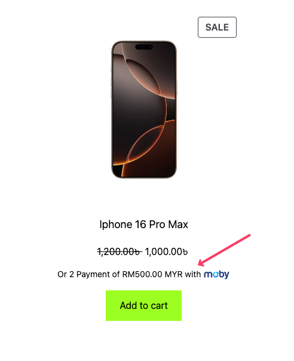

# Price Divider Plugin for WooCommerce

[**Download the Moby Price Divider Plugin**](https://raw.githubusercontent.com/MobyPayTech/moby-plugins/main/woocommerce/price-divider/moby-price-divider.zip)

## Description

The **Price Divider** plugin for WooCommerce enables store owners to display product prices in installments. This feature allows customers to view a breakdown of the product price into manageable payments, enhancing affordability and improving conversion rates.

The plugin supports customizable installment counts, minimum price thresholds, and branding with platform logos. Store administrators can configure all settings through a dedicated admin panel.

## Features

- Display installment options for WooCommerce products.
- Configurable installment counts (e.g., 2, 3, 6 payments).
- Minimum price threshold for displaying installment options.
- Toggle plugin functionality on or off.
- Dynamic branding with platform-specific logos.
- Easy-to-use admin settings panel.

## Installation

1. Download The Plugin [Click Here](https://raw.githubusercontent.com/MobyPayTech/moby-plugins/main/woocommerce/price-divider/moby-price-divider.zip)
2. Navigate to your WordPress admin dashboard.
3. Go to **Plugins > Add New** and click on the **Upload Plugin** button.
4. Select the moby-price-divider.zip file and click **Install Now**.
5. Once installed, click **Activate Plugin**.

## Configuration

1.  Go to **Settings > Price Divider** in the WordPress admin panel.

    

2.  Configure the following options:

    - **Minimum Price To Show Price Divider**: Set the minimum product price required to display installment options.
    - **Installment Count**: Specify the number of installment payments.
    - **Platform**: Choose between "Moby" or "Moby Islamic" for platform-specific branding.
    - **Enable Plugin**: Toggle the plugin's functionality on or off.

3.  Save changes.

## Usage

The plugin automatically integrates with your WooCommerce store and displays installment options below product prices on:

- Product listing pages (shop and category pages).

- Single product pages.

### Example Display:

### 1. Shop Page

### 2. Single Product Page

## Requirements

- WordPress 5.5 or higher.
- WooCommerce 4.0 or higher.
- PHP 7.4 or higher.

## Troubleshooting

### Common Issues:

1.  **Installment options not showing**:

    - Ensure the product price exceeds the minimum threshold.
    - Verify the plugin is enabled in settings.

2.  **Incorrect logo displayed**:

    - Check the selected platform in settings.

3.  **Plugin not working after activation**:

    - Ensure proper file permissions are set on your WordPress installation.
    - phpCopy codedefine('FS_METHOD', 'direct');

## Changelog

### Version 1.0.0

- Initial release with installment display functionality.
- Admin settings panel with customizable options.

## License

This plugin is licensed under the GPL-2.0-or-later license.

## Additional Support

For further assistance, you can reach our support teams:

- **Customer Care**:

  - Email: [customercare@moby.my](mailto:customercare@moby.my)
  - Phone: 011 1111 5155

- **Merchant Support**:
  - Email: [merchantsupport@moby.my](mailto:merchantsupport@moby.my)
  - Phone: 011 1111 7177
